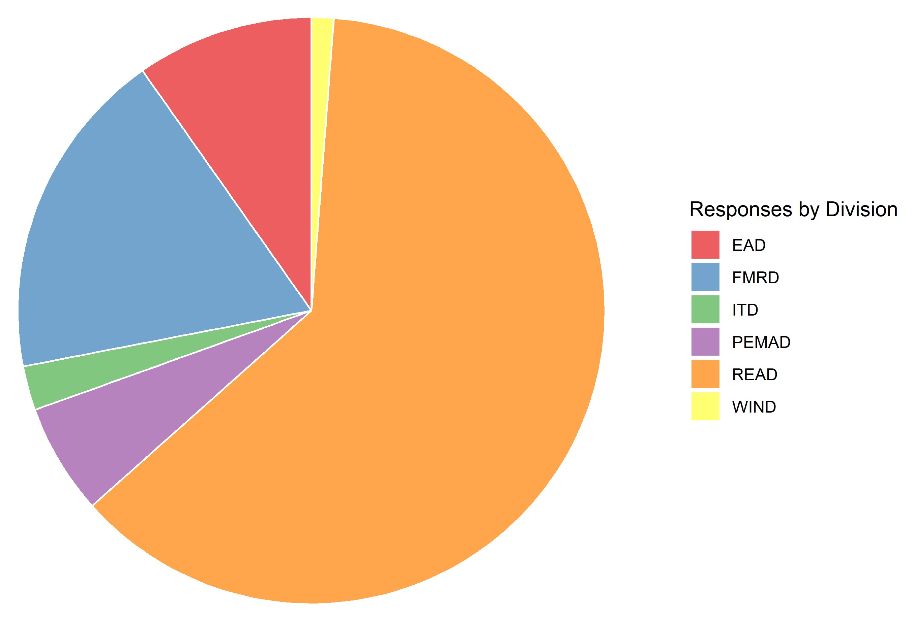
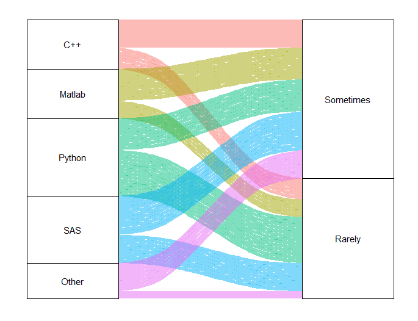

class: top, left

```{r setup, include=FALSE}
options(htmltools.dir.version = FALSE)
knitr::opts_chunk$set(echo = F,
                      fig.retina = 3,
                      #fig.width = 4,
                      #fig.height = 2,
                      fig.asp = 0.45,
                      warning = F,
                      message = F)
#Plotting and data libraries
library(tidyverse)
library(tidyr)
library(here)
library(kableExtra)
library(readxl)
library(DT)
```

```{r, echo=FALSE, message=FALSE, warning=FALSE}
dat<- read.csv(here::here("R _ RShiny  Survey (Responses) - Form Responses 1.csv"))
library(tidyverse)

dat2<-dat %>% 
  mutate(Branch = recode(Branch, 
                         "Population Biology Branch" = "PBB", 
                         "Population Dynamics Branch" = "PDB", 
                         "Cooperative Research" = "CRB", 
                         "Population Dynamics" = "PDB", 
                         "PopDy" = "PDB", 
                         "READ-EDAB" = "EDAB", 
                         "Protected Species Branch" = "PSB", 
                         "Habitat Ecology Branch" = "HEB", 
                         "Data and Information Systems" = "DIS FMRD", 
                         "READ/PDB" = "PDB", 
                         "Population dynamics" = "PDB", 
                         "Cooperative Research Branch" = "CRB", 
                         "Cooperative Research Branch " = "CRB",
                         "Social Sciences Branch " = "SSB", 
                         "Social Sciences Branch" = "SSB",
                         "Habitat Ecology" = "HEB", 
                         "DIS FMRD" = "DIS", 
                         "Protected Species" = "PSB", 
                         "DIS FMRD" = "DIS", 
                         "Aquaculture Sustainability Branch" = "ASB", 
                         "Atlantic Salmon Ecosystems Research Team" = "PSB", 
                         "Training and Data Quality Branch"  = "TDQB", 
                         "Project Management" = "ITD", 
                         "FMRD-FMO" = "FMO", 
                         "FMRD/DIS" = "DIS", 
                         "EAD/AS" = "ASB"
                         )) %>% 
  rename("R_users" = "What.programming.software.do.you.use..and.how.often...R.", 
         "Py_users" = "What.programming.software.do.you.use..and.how.often...Python.", 
         "Mat_users" = "What.programming.software.do.you.use..and.how.often...Matlab.", 
         "IDL_users" = "What.programming.software.do.you.use..and.how.often...IDL.", 
         "SAS_users" = "What.programming.software.do.you.use..and.how.often...SAS." , 
         "Cpp_users" = "What.programming.software.do.you.use..and.how.often...C...", 
         "StatisticalAnalysis" = "In.what.capacity.do.you.use.R.as.a.part.of.your.work...Statistics.Data.Analysis.", 
         "Reporting" = "In.what.capacity.do.you.use.R.as.a.part.of.your.work...Reporting." , 
         "DataQAQC" = "In.what.capacity.do.you.use.R.as.a.part.of.your.work...Data.QA.QC." , 
         "Wrangling" = "In.what.capacity.do.you.use.R.as.a.part.of.your.work...Data.Wrangling.Manipulation.", 
         "Visualization" = "In.what.capacity.do.you.use.R.as.a.part.of.your.work...Data.Visualization." , 
         "Advanced_tools" = "Do.you.use.any.of.the.following.advanced.tools.in.RStudio.", 
         "N_shiny_users" = "Do.you.develop.Shiny.applications.in.R.or.are.you.interested.in.learning.more.about.Shiny.", 
         "Time_server_vs_local" = "How.much.time.do.you.spend.working.in.R.on.a.NEFSC.server.vs.working.on.your.local.machine.", 
         "shiny_obstacles" = "If.you.are.interested.in.creating.using.a.Shiny.app..but.haven.t.been.able.to.implement.one..what.challenges.are.you.facing..", 
         "Public_products" = "Do.you.have.projects.that.would.benefit.from.a.public.facing.Shiny.server." , 
         "RstudioConnect" = "Would.RStudio.Connect.be.useful.for.any.of.your.projects.", 
         "server_vs_connect" =  "Would.you.be.most.interested.in.", 
         "rbasic" = "Would.you.be.interested.in.participating.in.trainings...R.basics.", 
         "shiny" = "Would.you.be.interested.in.participating.in.trainings...Shiny.", 
         "shinyserver" = "Would.you.be.interested.in.participating.in.trainings...Shiny.on.the.server.", 
         "rstudioconnect" = "Would.you.be.interested.in.participating.in.trainings...RStudio.Connect." , 
         "rforreporting" = "Would.you.be.interested.in.participating.in.trainings...R.for.reporting.",
         "other" = "Would.you.be.interested.in.participating.in.trainings...Other.RStudio.advanced.tools..RMarkdown..etc..."
         )


```

background-image: url("EDAB_images/background4.png")
background-size: 1200px 
background-position: right


## Presentation Overview

1. Purpose
2. Survey Findings
3. Potential Shiny Ideas
4. Support Required
5. Links to current NEFSC shiny apps

## Purpose 

- gain a better understanding of how and where people are using R in their work. 
- identify common bottlenecks and areas where we can further support each other. 
- highlight need for public facing tool to host shiny apps. 


---
background-image: url("EDAB_images/background4.png")
background-size: 1200px 
background-position: right

## Survey Findings

### This survey recieved `r length(unique(dat2$Name))` responses from 16 different NEFSC Branches. 
- Lots of R users at the center.

```{r,echo = FALSE, message = FALSE, warning=FALSE, fig.width=10}
order<- c("R_users", "SAS_users", "Py_users", "Mat_users", "Cpp_users", "IDL_users")

dat2 %>% dplyr::select(R_users, Py_users, Mat_users, IDL_users, SAS_users, Cpp_users) %>% 
  tidyr::pivot_longer(.,cols = c(R_users, Py_users,  Mat_users, IDL_users, SAS_users, Cpp_users), names_to = "Var", values_to = "Category") %>% 
  mutate(Value = c(1)) %>% 
  group_by(Var, Category) %>% 
  summarise(Value = sum(Value)) %>% 
  ungroup() %>% 
  mutate(Category = recode(Category, 
                           "This is the language I use the most" = "Most", 
                           "I sometimes use this, This is the language I use the most" = "Most",
                           "I sometimes use this" = "Sometimes",
                           "Maybe once or twice" = "Rarely",
                           "I don't use this" = "Never", 
                           "I don't use this, Maybe once or twice" = "Never")) %>% 
  filter(!Category == "", 
         !Category == "Never") %>% 
  mutate(Category = factor(Category, levels = c( "Rarely", "Sometimes","Most")), 
         Var = factor(Var, levels =c("IDL_users", "Cpp_users", "Mat_users", "Py_users","SAS_users","R_users"))) %>% 
    group_by(Var) %>% 
  mutate(total = sum(Value), 
         perc = (Value/total *100)) %>% 
  ungroup() %>% 
  ggplot2::ggplot()+
  ggplot2::geom_col(aes( y = Var, x = Value,  fill = Category))+
  ggplot2::ggtitle("Number of Software Users")+
  ggplot2::ylab(element_blank())+
  ggplot2::xlab("Number of Survey Participants")+
  ggplot2::theme(legend.title = element_blank(), 
                 legend.position = "bottom") +
  scale_x_continuous(n.breaks = 12,  expand = c(0,1))+
  #scale_x_continuous(breaks = round(seq(min(dat$x), max(dat$x), by = 0.5),1)
  ecodata::theme_ts()

```


---
background-image: url("EDAB_images/background4.png")
background-size: 1200px 
background-position: right

## Survey Findings

### Which Divisions/Branches participated in the survey?

```{r,echo = FALSE, message = FALSE, warning = FALSE, out.width="50%"}


```

---
background-image: url("EDAB_images/background4.png")
background-size: 1200px 
background-position: right

## Survey Findings

### Programming software in use @NEFSC

```{r,echo = FALSE, message = FALSE, warning = FALSE, out.width = "75%"}
knitr::include_graphics("EDAB_images/main_software.png")
```

---
background-image: url("EDAB_images/background4.png")
background-size: 1200px 
background-position: right

## Survey Findings

### If an R user, what other programming software was used?

```{r,echo = FALSE, message = FALSE, warning = FALSE, out.width = "75%"}

```

---
background-image: url("EDAB_images/background4.png")
background-size: 1200px 
background-position: right

## Survey Findings

### Most folks using R for Stats, Data Wrangling and Visualization. 
- Fewer folks using R for Reporting. 
- This is reflected in training interests slide XX. 

```{r, echo = FALSE, message = FALSE, warning=FALSE, fig.width=10}
dat2 %>% dplyr::select(StatisticalAnalysis, Reporting, DataQAQC, Wrangling, Visualization) %>% 
  tidyr::pivot_longer(.,cols = c(StatisticalAnalysis, Reporting, DataQAQC, Wrangling, Visualization), names_to = "Var", values_to = "Category") %>% 
  mutate(Value = c(1)) %>% 
  group_by(Var, Category) %>% 
  summarise(Value = sum(Value)) %>% 
  ungroup() %>% 
  #mutate(Category = recode(Category, 
                           # "This is the language I use the most" = "Most", 
                           # "I sometimes use this, This is the language I use the most" = "Most",
                           # "I sometimes use this" = "Sometimes",
                           # "Maybe once or twice" = "Rarely",
                           # "I don't use this" = "Never", 
                           # "I don't use this, Maybe once or twice" = "Never")) %>% 
  filter(!Category == "", 
         !Category == "Never", 
         !Category == "Not sure") %>% 
  mutate(Category = factor(Category, levels = c("I would if I knew how", "Occasionally", "Often","Regularly" ))) %>% 
  ggplot2::ggplot()+
  ggplot2::geom_col(aes( y = Var, x = Value,  fill = Category))+
  ggplot2::ggtitle("How are folks using R")+
  ggplot2::ylab(element_blank())+
  ggplot2::xlab("Number of Survey Participants")+
  ggplot2::theme(legend.title = element_blank()) +
  ecodata::theme_ts()
```


---

## Shiny Ideas

### Expanding NEFSC work with public shiny
- Lots of ideas for advancing NEFSC work 
- Some already underway*

```{r,echo = FALSE, message = FALSE, warning = FALSE, out.width = "100%"}

```

---


## Shiny Ideas

### Ideas that improve stakeholder engagement, science, and outreach.  
- Some already underway*

```{r,echo = FALSE, message = FALSE, warning = FALSE, out.width = "100%"}

```

---

background-image: url("EDAB_images/background4.png")
background-size: 1200px 
background-position: right

## How to support this interest: Public Shiny

### **63%** of participants have work that would benefit from a public shiny instance.
- Most survey participants would like more information about the options. 

<!-- ```{r, echo = FALSE, message = FALSE, warning=FALSE, fig.height= 5} -->
<!-- dat6<- dat2 %>%  -->
<!--   select(Public_products) %>%  -->
<!--   filter(!Public_products == "") %>%  -->
<!--   mutate(N = c(1)) %>%  -->
<!--   group_by(Public_products) %>%  -->
<!--   summarise(N = sum(N)) %>%  -->
<!--   ungroup() %>%  -->
<!--   mutate(perc = N/sum(N)*100,  -->
<!--          other = c("1"))# %>%  -->
<!--   #mutate(Time = factor(Time_server_vs_local,  -->
<!--   #levels = c( "100% server","60% - 80% server","40% - 60% server", -->
<!--   #            "20% - 40% server","Less than 20% on the sever","100% locally")))  -->

<!-- dat6 %>% ggplot2::ggplot(aes(x = "", y = N, fill = Public_products))+ -->
<!--    ggplot2::geom_bar(stat = "identity", width = 1,color="white")+ -->
<!--   ggplot2::coord_polar("y", start = 0)+ -->
<!--   #  ggplot2::ggplot()+ -->
<!--   #ggplot2::geom_col(aes( y = Var, x = Value,  fill = Category))+ -->
<!--   ggplot2::ggtitle("Would your benefit from a public facing shiny server?")+ -->
<!--   ggplot2::ylab(element_blank())+ -->
<!--   ggplot2::xlab(element_blank())+ -->
<!--   #ggplot2::geom_text(aes(x = other, y = perc, fill = Public_products, label = paste0(round(perc),"%")),  -->
<!--   #      position = position_stack(vjust = 0.5))+ -->

<!--   theme_void()+ -->
<!--   ggplot2::geom_text(aes(x = "", y = N, fill = Public_products, label = paste0(round(perc),"%")),  -->
<!--         position = position_stack(vjust = 0.5),  -->
<!--         color = "white")+ -->
<!--     ggplot2::theme(legend.title = element_blank()) + -->
<!--   ecodata::theme_ts() -->
<!-- ``` -->

```{r, echo = FALSE, message = FALSE, warning=FALSE, out.width="100%"}
dat8<- dat2 %>% 
  select(server_vs_connect) %>% 
  filter(!server_vs_connect == "", 
         !server_vs_connect == "expanding my ability to use R so that I could assess if it would be useful in producing my deliverables", 
         !server_vs_connect == "I am at a more basic level and need to carve the time to learn", 
         !server_vs_connect == "internal shiny server") %>% 
  mutate(N = c(1)) %>% 
  group_by(server_vs_connect) %>% 
  summarise(N = sum(N)) %>% 
  ungroup() %>% 
  mutate(perc = N/sum(N)*100, 
         other = c("1"))# %>% 
  #mutate(Time = factor(Time_server_vs_local, 
  #levels = c( "100% server","60% - 80% server","40% - 60% server",
  #            "20% - 40% server","Less than 20% on the sever","100% locally"))) 

dat8 %>% ggplot2::ggplot()+
   ggplot2::geom_col(aes(x = other, y = perc, fill = server_vs_connect))+
  ggplot2::coord_polar("y", start = 0)+
  #  ggplot2::ggplot()+
  #ggplot2::geom_col(aes( y = Var, x = Value,  fill = Category))+
  theme_void()+
  ggplot2::geom_text(aes(x = other, y = perc, fill = server_vs_connect, label = paste0(round(perc),"%")), 
        position = position_stack(vjust = 0.5), 
        color = "white")+
  ggplot2::ggtitle("RStudio Connect vs Public Shiny Server")+
  ggplot2::ylab("Percent of participants")+
  ggplot2::xlab(element_blank())+
  ggplot2::theme(legend.title = element_blank(), 
                 axis.text.x=element_blank()) +
  ecodata::theme_ts()

```

---
background-image: url("EDAB_images/background4.png")
background-size: 1200px 
background-position: right

## How to support this interest: Trainings

### R users are interested in training on more advanced R topics. 

```{r, echo = FALSE, message = FALSE, warning=FALSE, fig.width=10}
dat9<-dat2 %>% dplyr::select(rbasic, shiny, shinyserver, rstudioconnect, rforreporting, other) %>% 
  tidyr::pivot_longer(.,cols = c(rbasic, shiny, shinyserver, rstudioconnect, rforreporting, other), names_to = "Var", values_to = "Category") %>% 
  filter(!Category == "Interested, I might join", 
         !Category == "") %>% 
  mutate(Value = c(1)) %>% 
  group_by(Var, Category) %>% 
  summarise(Value = sum(Value)) %>% 
  ungroup() %>% 
  # mutate(Category = recode(Category, 
  #                          "This is the language I use the most" = "Most", 
  #                          "I sometimes use this, This is the language I use the most" = "Most",
  #                          "I sometimes use this" = "Sometimes",
  #                          "Maybe once or twice" = "Rarely",
  #                          "I don't use this" = "Never", 
  #                          "I don't use this, Maybe once or twice" = "Never")) %>% 
   
  #       !Category == "Never") %>% 
  mutate(Category = factor(Category, 
                           levels = c( "No Thanks", "I might join",
                                        "Interested","Super Interested" ))) %>% 
  group_by(Var) %>% 
  mutate(total = sum(Value), 
         perc = (Value/total *100)) %>% 
  ungroup()
dat9 %>%   ggplot2::ggplot()+
  ggplot2::geom_col(aes( x = Var, y = perc,  fill = Category))+
  ggplot2::ggtitle("Would you be interested in participating in trainings?")+
  ggplot2::ylab("Percent of participants")+
  ggplot2::geom_text(aes(x = Var, y = perc, fill =  Category, label = paste0(round(perc),"%")), 
        position = position_stack(vjust = 0.5))+
  ggplot2::xlab(element_blank())+
  ggplot2::theme(legend.title = element_blank()) +
  ecodata::theme_ts()
```

---
background-image: url("EDAB_images/background4.png")
background-size: 1200px 
background-position: right

# Summary

- Lots of R use at the NEFSC
 - Interest in further training and support for R commmunity
- Opportunites to enhance NEFSC work with public shiny
  - Stakeholder Engagement
  - Better Science
  - Further Education
- Support Required
 - Public facing tool to host shiny apps
 - Training in shiny and related tools
 
 
## Find more on us 
- Shiny user group
- Current apps in development - [shiny-book](https://github.com/NEFSC/READ-shiny-book)


